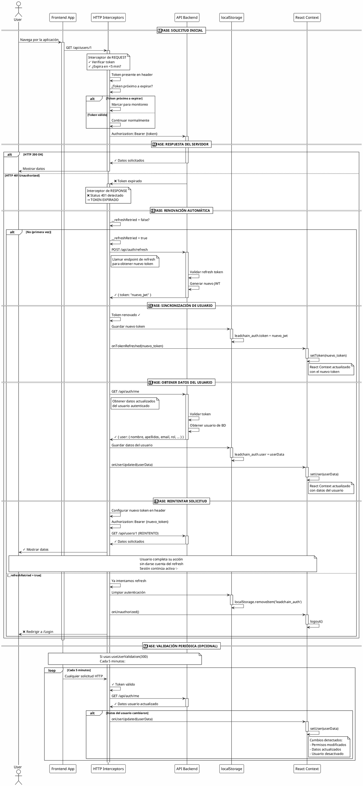

# 📋 GUÍA RÁPIDA: Sistema de Auto-Refresh de Token con Sincronización de Usuario

## ¿QUÉ SE IMPLEMENTÓ?

✅ **Sistema automático de renovación de tokens (JWT)**
✅ **Sincronización automática de datos del usuario**
✅ **El usuario NO verá interrupciones de sesión**
✅ **El token se renueva transparentemente en background**
✅ **Validación periódica del usuario desde servidor**

---

## 📁 ARCHIVOS MODIFICADOS Y CREADOS

### 1️⃣ NUEVO: `src/services/tokenManager.ts`

- Decodifica JWT y detecta expiración
- Funciones: `isTokenExpiringIn()`, `getTimeUntilExpiry()`, `getTokenExpirationTime()`
- Importar:
  ```typescript
  import { isTokenExpiringIn, getTimeUntilExpiry } from '@/services/tokenManager'
  ```

### 2️⃣ MODIFICADO: `src/services/https.ts`

- ✅ **Interceptor de request**: Detecta tokens próximos a expirar
- ✅ **Interceptor de response**: Renueva automáticamente si error 401
- ✅ **Función `attemptTokenRefresh()`**:
  - Llama `/api/auth/refresh` → obtiene nuevo token
  - Llama `/api/auth/me` → sincroniza datos del usuario
  - Evita múltiples refresh simultáneos
- ✅ **Callbacks**:
  - `onTokenRefreshed(token)` - Sincroniza token con React
  - `onUserUpdated(user)` - Sincroniza datos de usuario

### 3️⃣ MODIFICADO: `src/auth/authProvider.tsx`

- Maneja `onTokenRefreshed` callback para actualizar token
- Maneja `onUserUpdated` callback para actualizar datos del usuario
- El estado de React se sincroniza automáticamente

### 4️⃣ NUEVO: `src/examples/useTokenHooks.ts`

- `useTokenLifetime()` - Monitorea tiempo restante del token
- `useTokenRefreshNotification()` - Detecta renovaciones
- `useUserValidation(intervalSeconds)` - Valida usuario periódicamente ⭐ NUEVO
  - Sincroniza datos cada X segundos (default: 5 minutos)
  - Retorna: `isValidating`, `lastValidation`, `validationError`

### 5️⃣ NUEVO: `src/examples/TokenRefreshExamples.tsx`

- `ExampleTokenMonitor` - Muestra tiempo restante
- `SessionStatusBadge` - Indicador visual de renovación
- `Dashboard` - Dashboard de ejemplo
- `TokenRefreshNotifier` - Notificaciones
- `SessionExpirationWarning` - Advertencias
- `UserValidationIndicator` - Muestra datos del usuario y estado de sincronización ⭐ NUEVO

---

## 🔄 ¿QUÉ HACE EL ENDPOINT `/api/auth/me`?

### Propósito

Obtiene la información **actualizada** del usuario autenticado desde el servidor.

### Respuesta típica

```json
{
  "success": true,
  "user": {
    "id": 1,
    "nombre": "Juan",
    "apellidos": "González",
    "email": "juan@example.com",
    "rol": "vendedor",
    "id_zona": 5
  },
  "dashboard": { ... }
}
```

### ¿Qué valida?

| Validación                    | Descripción                                 |
| ------------------------------ | -------------------------------------------- |
| ✅**Token válido**      | Verifica que el JWT sea correcto             |
| ✅**Usuario existe**     | Confirma que el usuario aún existe en la BD |
| ✅**Usuario activo**     | Comprueba si no fue desactivado              |
| ✅**Permisos**           | Obtiene el rol actual del usuario            |
| ✅**Datos actualizados** | Trae información fresca del servidor        |

### Por qué lo integramos

**Detecta automáticamente**:

- ❌ Usuario fue desactivado desde otro lugar → **Logout automático**
- ❌ Cambio de permisos/rol → **Actualiza permisos**
- ❌ Cambios de datos del usuario → **Sincroniza al contexto**

---

## 🔄 FLUJO COMPLETO DE AUTO-REFRESH + SINCRONIZACIÓN

```
Usuario hace solicitud HTTP
        ↓
Interceptor Request
├─ ¿Token a punto de expirar? → Marcar para monitoreo
├─ Agregar header: Authorization: Bearer <token>
└─ Enviar solicitud
        ↓
Servidor responde
        ↓
Interceptor Response
├─ ¿Status 401? → Token expirado
│   ├─ POST /api/auth/refresh → Nuevo token ✓
│   ├─ GET /api/auth/me → Datos usuario actualizado ✓
│   ├─ localStorage.set(newToken + userData)
│   ├─ Context.setToken(newToken)
│   ├─ Context.setUser(updatedUser)
│   └─ Reintentar solicitud original con nuevo token ✓
├─ ¿Status 200? → Solicitud exitosa
│   └─ Retornar respuesta
└─ ¿Otro error? → Retornar error
        ↓
Usuario recibe resultado como si nada hubiera pasado ✨
```

---

## 🧪 PRUEBAS MANUALES

### 1. Verificar renovación de token

```bash
1. Abre DevTools (F12)
2. Ve a Application → Local Storage
3. Busca "leadchain_auth" y copia el token
4. Espera 5+ minutos o navega por la aplicación
5. Haz una solicitud HTTP (navega a otra página)
6. Verifica que el token cambió en Local Storage
7. En Network tab busca "/api/auth/refresh" → debe estar
```

### 2. Verificar sincronización de usuario

```bash
1. Abre DevTools → Network tab
2. Filtra por "me" (endpoint /api/auth/me)
3. Navega por la aplicación durante unos minutos
4. Verifica que apareixen llamadas a "/api/auth/me"
5. Cada renovación de token debe incluir una llamada a /me
```

### 3. Desde la consola

```javascript
// Ver token actual
JSON.parse(localStorage.getItem('leadchain_auth')).token

// Ver datos del usuario
JSON.parse(localStorage.getItem('leadchain_auth')).user

// Ver cuánto tiempo queda
import { getTimeUntilExpiry } from '@/services/tokenManager'
const token = JSON.parse(localStorage.getItem('leadchain_auth')).token
getTimeUntilExpiry(token) // en segundos
```

---

## 🎨 MOSTRAR ESTADO EN UI (OPCIONAL)

### Indicador de tiempo restante

```typescript
import { useAuth } from '@/auth/useAuth';
import { getTimeUntilExpiry } from '@/services/tokenManager';

export function SessionTimer() {
  const { token } = useAuth();
  const timeLeft = getTimeUntilExpiry(token);
  const minutes = Math.floor((timeLeft || 0) / 60);
  
  return <span>Sesión expira en: {minutes} minutos</span>;
}
```

### Indicador de sincronización de usuario

```typescript
import { useUserValidation } from '@/examples/useTokenHooks';

export function UserSyncStatus() {
  const { isValidating, lastValidation } = useUserValidation(300);
  
  return (
    <div>
      {isValidating && <span>⟳ Sincronizando...</span>}
      {lastValidation && <span>✓ Actualizado: {lastValidation.toLocaleTimeString()}</span>}
    </div>
  );
}
```

### Mostrar datos del usuario

```typescript
import { useAuth } from '@/auth/useAuth';

export function UserInfo() {
  const { user } = useAuth();
  
  return (
    <div>
      <p>{user?.nombre} {user?.apellidos}</p>
      <p>{user?.email}</p>
      <p>Rol: {user?.rol}</p>
    </div>
  );
}
```

---

## ⚙️ CONFIGURACIÓN PERSONALIZADA

### Cambiar umbral de renovación (5 minutos = 300 segundos)

En `src/services/https.ts`, línea ~48:

```typescript
if (isTokenExpiringIn(session.token, 300)) {  // ← Cambiar 300
```

**Ejemplos**:

- `60` = Renovar 1 minuto antes
- `300` = Renovar 5 minutos antes (default)
- `600` = Renovar 10 minutos antes
- `1800` = Renovar 30 minutos antes

### Cambiar intervalo de validación de usuario

En tu componente:

```typescript
// Default: 300 segundos (5 minutos)
const { isValidating, lastValidation } = useUserValidation(300);

// Cambiar a 1 minuto
const { isValidating, lastValidation } = useUserValidation(60);

// Cambiar a 10 minutos
const { isValidating, lastValidation } = useUserValidation(600);
```

---

## 🔍 MONITOREO EN DESARROLLO

### Agregar logging detallado

En `src/services/https.ts`, antes de los interceptores:

```typescript
if (import.meta.env.DEV) {
  console.log('[🔐 Auth] Sistema de Auto-Refresh iniciado');
}
```

En `attemptTokenRefresh()`:

```typescript
console.log('[🔄 Refresh] Renovando token...');
console.log('[👤 Me] Obteniendo datos del usuario...');
console.log('[✓ Refresh] Token renovado exitosamente');
```

### Ver logs en DevTools

1. Abre DevTools → Console
2. Busca logs con formato `[🔄 Refresh]`, `[👤 Me]`
3. Podrás ver cada renovación y sincronización en tiempo real

---

## ❓ PREGUNTAS FRECUENTES

### P: ¿Funciona si cambio de pestaña?

**R:** Sí, el token se renueva cuando hagas cualquier solicitud HTTP, independientemente de en qué pestaña estés.

### P: ¿Qué pasa si el servidor rechaza el refresh?

**R:** Se redirige a `/Login` automáticamente y se limpia la autenticación.

### P: ¿Se renuevan múltiples veces simultáneamente?

**R:** No, el sistema usa `refreshPromise` para evitar múltiples llamadas concurrentes.

### P: ¿Qué pasa si `/api/auth/me` falla?

**R:** El token se renovó correctamente, pero si `/me` falla no es crítico - el usuario continúa conectado. Cuando funcione volverá a sincronizar.

### P: ¿Debo hacer algo en el backend?

**R:** No, ambos endpoints (`/api/auth/refresh` y `/api/auth/me`) ya existen en tu backend.

### P: ¿Cómo desactivo la validación periódica de usuario?

**R:** Simplemente no uses el hook `useUserValidation()`. Solo el auto-refresh seguirá funcionando.

### P: ¿Puedo cambiar qué datos se sincronizan?

**R:** Sí, modifica el response de `/api/auth/me` en el backend para incluir/excluir campos.

---

## 🔧 INFO TÉCNICA

### Función: `attemptTokenRefresh()`

```
├─ Evita circularidad importando authService dinámicamente
├─ POST /api/auth/refresh → Nuevo token
├─ GET /api/auth/me → Datos usuario
├─ Actualiza localStorage automáticamente
├─ Usa refreshPromise para prevenir múltiples llamadas
├─ Notifica al Context mediante onTokenRefreshed
├─ Notifica al Context mediante onUserUpdated
└─ Maneja errores silenciosamente
```

### Interceptor Request

```
├─ Verifica expiración del token
├─ ¿Token vence en <5 min? → Marcar para monitoreo
├─ Agrega Header: Authorization: Bearer <token>
└─ Enviar solicitud
```

### Interceptor Response

```
├─ ¿Status 401? → Token expirado
│   ├─ Llamar attemptTokenRefresh()
│   ├─ Reintentar solicitud original
│   └─ Si falla 2da vez → redirigir a /Login
├─ ¿Status 200? → Solicitud exitosa
│   └─ Retornar respuesta
└─ ¿Otro error? → Retornar error
```

---

## 📦 DEPENDENCIAS USADAS

- `axios` ^1.13.6 (ya instalado)
- No requiere librerías adicionales
- Compatible con TypeScript
- Funciona con React 18+

---

## 🆘 SOPORTE Y DOCUMENTACIÓN

Para dudas o problemas, revisa:

1. **`README-TOKEN-REFRESH.md`** - Documentación completa y detallada
2. **`src/examples/TokenRefreshExamples.tsx`** - Ejemplos de componentes
3. **`src/examples/useTokenHooks.ts`** - Documentación de hooks
4. **Comentarios en el código** - Busca `[Token Refresh]`, `[🔄 Refresh]`, `[👤 Me]`

---

## ✅ CHECKLIST DE IMPLEMENTACIÓN

- ✅ `src/services/tokenManager.ts` - Creado
- ✅ `src/services/https.ts` - Modificado con interceptores mejorados
- ✅ `src/auth/authProvider.tsx` - Modificado con nuevos callbacks
- ✅ `src/examples/useTokenHooks.ts` - Creado con hooks
- ✅ `src/examples/TokenRefreshExamples.tsx` - Creado con componentes
- ✅ `README-TOKEN-REFRESH.md` - Documentación completa
- ✅ `GUIA-RAPIDA-TOKEN-REFRESH.md` - Esta guía

---

# Diagrama



**🎉 ¡Sistema completamente implementado y listo para usar!**
