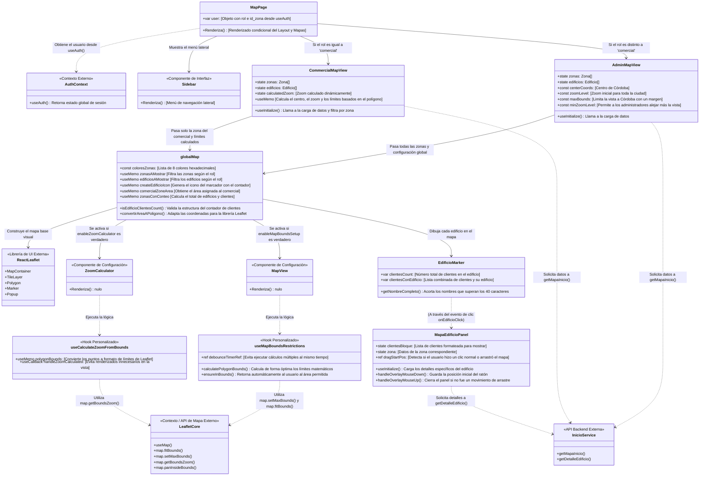

<h1 align="center">
  <a href="#">Leadchain Frontend</a>
</h1>

<h3 align="center">Frontend React para la gestión de clientes, edificios, visitas y zonas geolocalizadas.</h3>

<p align="center">
  <a href="https://github.com/AlbertoRomeroPino/Leadchain-frontend">
    
  </a>
  <a href="https://github.com/AlbertoRomeroPino/Leadchain-backend">
    
  </a>
</p>

<p align="center">
  <a href="#acerca">Acerca</a> •
  <a href="#caracteristicas">Características</a> •
  <a href="#como-funciona">Cómo funciona</a> •
  <a href="#tecnologias">Tecnologías</a> •
  <a href="#estructura-del-proyecto">Estructura</a> •
  <a href="#scripts">Scripts</a> •
  <a href="#autenticacion">Autenticacion</a> •
  <a href="#autor">Autor</a>
</p>

<h2 align="center" id="acerca"> Acerca </h2>

Leadchain Frontend es la aplicación cliente de un proyecto TFG para la gestión de rutas comerciales y visitas técnicas. Incluye autenticación por token, roles de usuario, mapas interactivos y paneles de control para clientes, edificios, zonas y comerciales.

- API Rest: [repositorio backend](https://github.com/AlbertoRomeroPino/Leadchain-backend.git)
- Frontend: [Repositorio Frontend](https://github.com/AlbertoRomeroPino/Leadchain-frontend.git)

---

<h2 align="center" id="caracteristicas">Características</h2>

- [X] Login con token JWT y almacenamiento de sesión
- [X] Renovación automática de token cuando expira
- [X] Gestión de clientes con detalle y edición
- [X] Gestión de edificios con ubicación geográfica
- [X] Gestión de zonas con polígonos sobre el mapa
- [X] Visualización de visitas y asignación por comercial
- [X] Control de acceso según roles (`admin` / `comercial`)
- [X] Mapa delimitado a Córdoba con restricciones de área
- [X] API Axios con interceptores para refresh y manejo de errores

---

<h2 align="center" id="como-funciona">Cómo funciona</h2>

El proyecto está dividido en dos partes:

1. Backend (API con Laravel)
2. Frontend (esta aplicación React)

Este repositorio contiene solo el frontend. El backend debe ejecutarse para que la app funcione correctamente.

<h3 align="center">Requisitos previos</h3>

Antes de empezar necesitas tener instalado:

- [Git](https://git-scm.com)
- [Node.js](https://nodejs.org/)
- [npm](https://www.npmjs.com/)

<h3 align="center">Ejecutar la aplicación web (Frontend)</h3>

```bash
# Clona este repositorio
git clone https://github.com/AlbertoRomeroPino/Leadchain-frontend.git

# Accede a la carpeta del proyecto
cd leadchain-frontend

# Instala las dependencias
npm install

# Inicia la aplicación en modo desarrollo
npm run dev
```

Abre el navegador en `http://localhost:5173`.

> Nota: Se necesita tener lanzado el backend para que funcione el login

---

<h2 align="center" id="tecnologias">Tecnologías</h2>

<h4 align="center">Plataforma </h4>

- **React** + **TypeScript**
- **Vite**

<h4 align="center">Librerías principales </h4>

- **React Router Dom**
- **Axios**
- **Leaflet**
- **React Leaflet**
- **Lucide React**
- **ESLint**
- **Sileo**

---

<h2 align="center">Hooks Utilizados</h2>

| **Hook**             | **¿Qué hace? (Resumen)** | **¿Para qué sirve?**                                  | **Ejemplo**                  |
| -------------------------- | -------------------------------- | ------------------------------------------------------------- | ---------------------------------- |
| **useState**         | Estado local                     | Guardar datos que cambian y refrescan la pantalla.            | `[user, setUser] = useState()`   |
| **useEffect**        | Sincronización                  | Ejecutar tareas tras renderizar (APIs, eventos).              | `useEffect(() => { ... }, [])`   |
| **useCallback**      | Memorizar funciones              | Evitar que una función se recree innecesariamente.           | `useCallback(() => { ... }, [])` |
| **useMemo**          | Memorizar valores                | Evitar cálculos pesados si no cambian las dependencias.      | `useMemo(() => calc(), [data])`  |
| **useContext**       | Datos globales                   | Acceder a datos compartidos (auth, tema) sin "prop drilling". | `useContext(AuthContext)`        |
| **useRef**           | Referencia mutable               | Acceder a elementos del DOM o guardar valores sin renderizar. | `const inputRef = useRef()`      |
| **useNavigate**      | Navegación                      | Cambiar de página mediante código.                          | `Maps('/dashboard')`             |
| **useLocation**      | Ubicación                       | Saber en qué ruta estás o qué parámetros lleva la URL.    | `useLocation().pathname`         |
| **useMap**           | Instancia mapa                   | Controlar directamente la API de Leaflet.                     | `const map = useMap()`           |
| **useMapEvents**     | Eventos múltiples               | Escuchar varios eventos del mapa (click, zoom, etc.).         | `useMapEvents({ click: ... })`   |
| **useMapEvent**      | Evento único                    | Escuchar un evento específico del mapa.                      | `useMapEvent('zoom', ...)`       |
| **useInitialize**    | Montaje (Custom)                 | Ejecutar una carga inicial asíncrona una sola vez.           | `useInitialize(getData)`         |
| **useCalculateZoom** | Cálculo (Custom)                | Ajustar el nivel de zoom basado en coordenadas.               | `useCalculateZoomFromBounds(b)`  |
| **useMapBounds**     | Restricciones (Custom)           | Limitar hasta dónde puede moverse el mapa.                   | `useMapBoundsRestrictions(b)`    |
| **useAuth**          | Auth (Custom)                    | Obtener información del usuario logueado fácilmente.        | `const { user } = useAuth()`     |

---

<h3 align="center"> Descripción breve </h3>

- `src/auth/ && src/context` — gestión de sesión y contexto de usuario.
- `src/components/` — componentes reutilizables de la UI.
- `src/pages/` — vistas principales de la aplicación.
- `src/services/` — llamadas a la API e interceptores HTTP.
- `src/utils/` — utilidades generales.
- `scripts/tree-front.js` — comando para mostrar la estructura del frontend.

---

<h2 align="center" id="scripts">Scripts</h2>

* `npm run dev`: Inicia el entorno de desarrollo en `http://localhost:5173`.
* `npm run build`: Genera el build para producción.
* `npm run tree`: Muestra la estructura de directorios filtrando archivos innecesarios.

<h3 align="center">npm run tree</h3>

Este comando imprime un árbol de directorios del frontend con exclusiones configurables.

```bash
npm run tree
```

Para excluir solo los iconos de `public/icons`:

```bash
npm run tree -- --exclude-icons
```

Para excluir elementos adicionales:

```bash
npm run tree -- --exclude=public/icons,archivo-extra
```

---

<h2 align="center" id="estructura-del-proyecto">Estructura del proyecto</h2>

```text
Leadchain-frontend
├── public
│   └── icons
│       ├── leadchain-logo.png
│       └── Logo.svg
├── scripts
│   └── tree-front.js
├── src
│   ├── auth
│   │   ├── AuthContext.ts
│   │   ├── authProvider.tsx
│   │   ├── authStorage.ts
│   │   └── useAuth.ts
│   ├── components
│   │   ├── Clientes
│   │   │   ├── Info
│   │   │   │   ├── InfoClienteDatosCard.tsx
│   │   │   │   ├── InfoClienteEdificioCard.tsx
│   │   │   │   ├── InfoClienteEditModal.tsx
│   │   │   │   ├── InfoClienteToolbar.tsx
│   │   │   │   └── InfoClienteVisitasCard.tsx
│   │   │   ├── ClienteForm.tsx
│   │   │   ├── ClienteInfo.tsx
│   │   │   ├── ClientesConEdificioTable.tsx
│   │   │   ├── ClientesCreateModal.tsx
│   │   │   ├── ClientesHeader.tsx
│   │   │   ├── ClientesSinEdificioTable.tsx
│   │   │   └── ClienteTabla.tsx
│   │   ├── Comerciales
│   │   │   ├── ComercialesForm.tsx
│   │   │   ├── ComercialesFormModal.tsx
│   │   │   ├── ComercialesHeader.tsx
│   │   │   ├── ComercialesRow.tsx
│   │   │   ├── ComercialesStatus.tsx
│   │   │   └── ComercialesTable.tsx
│   │   ├── Edificios
│   │   │   ├── FormularioModal
│   │   │   │   ├── EdificioModalCliente.tsx
│   │   │   │   ├── EdificioModalEdificio.tsx
│   │   │   │   ├── EdificioModalMapa.tsx
│   │   │   │   └── EdificioModalPestaña.tsx
│   │   │   ├── Info
│   │   │   │   ├── EdificioInfoClienteCard.tsx
│   │   │   │   ├── EdificioInfoClienteInfo.tsx
│   │   │   │   ├── EdificioInfoDetailsCard.tsx
│   │   │   │   ├── EdificioInfoMapCard.tsx
│   │   │   │   └── EdificioInfoToolbar.tsx
│   │   │   ├── EdificioCreateModal.tsx
│   │   │   ├── EdificioForm.tsx
│   │   │   ├── EdificioHeader.tsx
│   │   │   ├── EdificioInfo.tsx
│   │   │   └── EdificioTabla.tsx
│   │   ├── Inicio
│   │   │   ├── InicioAdmin
│   │   │   │   ├── ComercialCard
│   │   │   │   │   ├── ComercialCard.tsx
│   │   │   │   │   ├── ComercialCardIndividual.tsx
│   │   │   │   │   └── ComercialStatsBars.tsx
│   │   │   │   └── InicioAdmin.tsx
│   │   │   └── InicioComercial
│   │   │       ├── ClientesSinVisitar
│   │   │       │   ├── ClienteConVisitaCard.tsx
│   │   │       │   ├── ClienteSinVisitaCard.tsx
│   │   │       │   ├── ClientesSinVisitar.tsx
│   │   │       │   └── ClientesStats.tsx
│   │   │       └── InicioComercial.tsx
│   │   ├── MapSetup
│   │   │   ├── MAP_BOUNDS_RESTRICTIONS_GUIDE.md
│   │   │   ├── MapView.tsx
│   │   │   └── ZoomCalculator.tsx
│   │   ├── MapViews
│   │   │   ├── AdminMapView.tsx
│   │   │   ├── CommercialMapView.tsx
│   │   │   ├── EdificioMarker.tsx
│   │   │   └── MapBoundsSetup.tsx
│   │   ├── sidebar
│   │   │   └── MenuButtons.tsx
│   │   ├── utils
│   │   │   ├── cordobaMapConfig.ts
│   │   │   ├── errorHandler.ts
│   │   │   ├── globalMap.tsx
│   │   │   ├── MapaEdificioPanel.tsx
│   │   │   └── StatusAlert.tsx
│   │   ├── Visitas
│   │   │   ├── Admin
│   │   │   │   ├── VisitaCardAdmin.tsx
│   │   │   │   └── VisitasAdminGrid.tsx
│   │   │   ├── Comercial
│   │   │   │   ├── VisitaCardComercial.tsx
│   │   │   │   └── VisitasComercialGrid.tsx
│   │   │   ├── FormularioModal
│   │   │   │   └── VisitaFormularioModal.tsx
│   │   │   └── VisitasHeader.tsx
│   │   └── Zona
│   │       ├── FormularioModal
│   │       │   └── ZonaFormularioModal.tsx
│   │       ├── ZonaDetails.tsx
│   │       ├── ZonaHeader.tsx
│   │       ├── ZonaInfo.tsx
│   │       ├── ZonaList.tsx
│   │       └── ZonaMap.tsx
│   ├── guards
│   │   ├── ProtectedRoute.tsx
│   │   └── RolRoutes.tsx
│   ├── hooks
│   │   ├── useCalculateZoomFromBounds.ts
│   │   ├── useInitialize.ts
│   │   └── useMapBoundsRestrictions.ts
│   ├── layout
│   │   └── Sidebar.tsx
│   ├── pages
│   │   ├── ClientesPage.tsx
│   │   ├── ComercialesPage.tsx
│   │   ├── EdificiosPage.tsx
│   │   ├── InicioPage.tsx
│   │   ├── LoginPage.tsx
│   │   ├── MapPage.tsx
│   │   ├── NotFoundBSODPage.tsx
│   │   ├── VisitasPage.tsx
│   │   └── ZonaPage.tsx
│   ├── services
│   │   ├── authService.ts
│   │   ├── ClientesService.ts
│   │   ├── EdificiosService.ts
│   │   ├── EstadoVisitaService.ts
│   │   ├── ExceptionService.ts
│   │   ├── https.ts
│   │   ├── InicioService.ts
│   │   ├── tokenManager.ts
│   │   ├── User.ts
│   │   ├── UserService.ts
│   │   ├── VisitasService.ts
│   │   └── ZonaService.ts
│   ├── styles
│   │   ├── components
│   │   │   ├── Clientes
│   │   │   │   ├── Info
│   │   │   │   │   ├── InfoClienteDatosCard.css
│   │   │   │   │   ├── InfoClienteEdificioCard.css
│   │   │   │   │   ├── InfoClienteEditModal.css
│   │   │   │   │   ├── InfoClienteToolbar.css
│   │   │   │   │   └── InfoClienteVisitasCard.css
│   │   │   │   ├── ClienteForm.css
│   │   │   │   ├── ClienteInfo.css
│   │   │   │   ├── ClientesConEdificioTable.css
│   │   │   │   ├── ClientesCreateModal.css
│   │   │   │   ├── ClientesHeader.css
│   │   │   │   ├── ClientesSinEdificioTable.css
│   │   │   │   └── ClienteTabla.css
│   │   │   ├── Comerciales
│   │   │   │   ├── ComercialesForm.css
│   │   │   │   ├── ComercialesFormModal.css
│   │   │   │   ├── ComercialesHeader.css
│   │   │   │   ├── ComercialesRow.css
│   │   │   │   ├── ComercialesStatus.css
│   │   │   │   └── ComercialesTable.css
│   │   │   ├── Edificios
│   │   │   │   ├── FormularioModal
│   │   │   │   │   ├── EdificioModalCliente.css
│   │   │   │   │   ├── EdificioModalEdificio.css
│   │   │   │   │   ├── EdificioModalMapa.css
│   │   │   │   │   └── EdificioModalPestaña.css
│   │   │   │   ├── Info
│   │   │   │   │   ├── EdificioInfoClienteCard.css
│   │   │   │   │   ├── EdificioInfoDetailsCard.css
│   │   │   │   │   ├── EdificioInfoMapCard.css
│   │   │   │   │   └── EdificioInfoToolbar.css
│   │   │   │   ├── EdificioCreateModal.css
│   │   │   │   ├── EdificioForm.css
│   │   │   │   ├── EdificioHeader.css
│   │   │   │   ├── EdificioInfo.css
│   │   │   │   └── EdificioTabla.css
│   │   │   ├── Inicio
│   │   │   │   ├── InicioAdmin
│   │   │   │   │   ├── ComercialCard
│   │   │   │   │   │   ├── ComercialCard.css
│   │   │   │   │   │   ├── ComercialCardIndividual.css
│   │   │   │   │   │   └── ComercialStatsBars.css
│   │   │   │   │   └── InicioAdmin.css
│   │   │   │   └── InicioComercial
│   │   │   │       ├── ClientesSinVisitar
│   │   │   │       │   ├── ClienteConVisitaCard.css
│   │   │   │       │   ├── ClienteSinVisitaCard.css
│   │   │   │       │   ├── ClientesSinVisitar.css
│   │   │   │       │   └── ClientesStats.css
│   │   │   │       └── InicioComercial.css
│   │   │   ├── sidebar
│   │   │   │   ├── MenuButtons.css
│   │   │   │   └── Sidebar.css
│   │   │   ├── utils
│   │   │   │   ├── CommercialZoneInfo.css
│   │   │   │   ├── CommercialZoneMap.css
│   │   │   │   ├── globalMap.css
│   │   │   │   ├── MapaEdificioPanel.css
│   │   │   │   └── StatusAlert.css
│   │   │   ├── Visitas
│   │   │   │   ├── Admin
│   │   │   │   │   ├── VisitaCardAdmin.css
│   │   │   │   │   └── VisitasAdminGrid.css
│   │   │   │   ├── Comercial
│   │   │   │   │   ├── VisitaCardComercial.css
│   │   │   │   │   └── VisitasComercialGrid.css
│   │   │   │   ├── FormularioModal
│   │   │   │   │   └── VisitaFormularioModal.css
│   │   │   │   └── VisitasHeader.css
│   │   │   └── Zona
│   │   │       ├── FormularioModal
│   │   │       │   └── ZonaFormularioModal.css
│   │   │       ├── ZonaDetails.css
│   │   │       ├── ZonaHeader.css
│   │   │       ├── ZonaInfo.css
│   │   │       ├── ZonaList.css
│   │   │       └── ZonaMap.css
│   │   ├── Clientes.css
│   │   ├── Comerciales.css
│   │   ├── Edificios.css
│   │   ├── InfoCliente.css
│   │   ├── Inicio.css
│   │   ├── Login.css
│   │   ├── Map.css
│   │   ├── NotFound.css
│   │   ├── sileo.css
│   │   ├── Visitas.css
│   │   └── Zona.css
│   ├── types
│   │   ├── clientes
│   │   │   ├── Cliente.ts
│   │   │   ├── ClienteDetalle.ts
│   │   │   └── index.ts
│   │   ├── edificios
│   │   │   ├── Edificio.ts
│   │   │   └── index.ts
│   │   ├── shared
│   │   │   ├── GeoPoint.ts
│   │   │   └── index.ts
│   │   ├── users
│   │   │   ├── index.ts
│   │   │   └── User.ts
│   │   ├── visitas
│   │   │   ├── EstadoVisita.ts
│   │   │   ├── index.ts
│   │   │   └── Visita.ts
│   │   ├── zonas
│   │   │   ├── index.ts
│   │   │   └── Zona.ts
│   │   └── index.ts
│   ├── App.css
│   ├── App.tsx
│   ├── index.css
│   └── main.tsx
├── .env
├── .gitignore
├── index.html
├── package.json
└── README.md
```

---

<h2 align="center" id="autenticacion">Autenticación </h2>

El frontend incluye un sistema de sesión que renueva el token JWT automáticamente cuando la API devuelve `401`.

<h3 align="center">Qué hace </h3>

- Guarda el token y el usuario en `localStorage`.
- Detecta tokens próximos a expirar.
- Renueva el token automáticamente con `/api/auth/refresh`.
- Actualiza el contexto de React.
- Mantiene la sesión transparente al usuario.

<h3 align="center">Archivos clave</h3>

- `src/services/https.ts`
- `src/context/authProvider.tsx`
- `src/auth/authStorage.ts`
- `src/services/tokenManager.ts`

---

<h2 align="center"> Gestion de leaflet </h2>



---

<h2 align="center" id="autor">Autor</h2>

- **Alberto Romero Pino**
- **Email**: albertoromeropino2004@gmail.com
- **LinkedIn**: [linkedin.com/in/alberto-romero-pino-8aa0a32ba](linkedin.com/in/alberto-romero-pino-8aa0a32ba)

---

<h2 align="center">Más información</h2>

- [React](https://reactjs.org/)
- [TypeScript](https://www.typescriptlang.org/)
- [Vite](https://vitejs.dev/)
- [Leaflet](https://leafletjs.com/)
- [React Leaflet](https://react-leaflet.js.org/)
