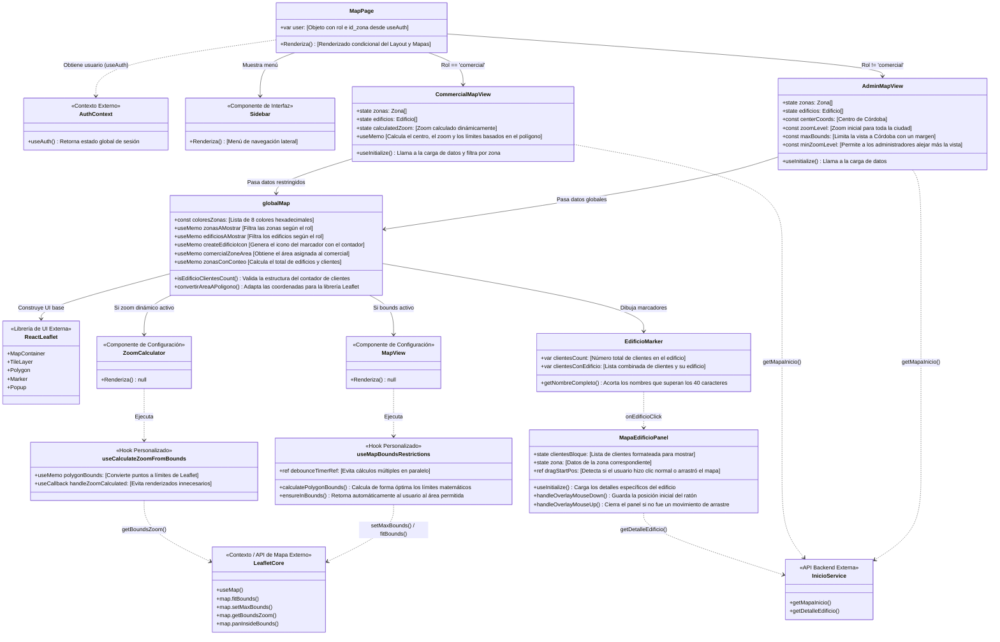

<h1 align="center">
  <a href="https://github.com/AlbertoRomeroPino/Leadchain-frontend" style="text-decoration: none; color: inherit;">Leadchain Frontend</a>
</h1>

<h3 align="center">Aplicación React para la gestión integral de rutas comerciales, edificios, clientes y visitas geolocalizadas.</h3>

<p align="center">
  <a href="https://github.com/AlbertoRomeroPino/Leadchain-frontend">
    
  </a>
</p>

<p align="center">
  <a href="https://github.com/AlbertoRomeroPino/Leadchain.git">
    
  </a>
  <a href="https://github.com/AlbertoRomeroPino/Leadchain-backend">
    
  </a>
</p>

<h4 align="center">Frameworks, lenguajes y herramientas usadas</h4>

<div align="center">
  
</div>

<h4 align="center">Librerías de mapas y notificaciones</h4>

<p align="center"> 
  <a href="https://leafletjs.com/">
    
  </a>
  <a href="https://sileo.aaryan.design/docs/styling">
    
  </a>
</p>

---

<h2 align="center" id="acerca">Acerca del Proyecto </h2>

**Leadchain** es la aplicación cliente (SPA) desarrollada como Trabajo de Fin de Grado (TFG) orientada a la optimización de rutas comerciales y la gestión integral de visitas técnicas en campo.

Diseñada bajo una arquitectura modular en React, la plataforma proporciona herramientas geoespaciales y de gestión en tiempo real, adaptando su interfaz de forma dinámica según el perfil del usuario.

<h3 align="center">Características Principales</h3>

* **Cartografía Interactiva Avanzada:** Renderizado dinámico de polígonos (zonas), marcadores (edificios) y cálculo de límites territoriales integrando la API de Leaflet.
* **Control de Acceso y Seguridad:** Autenticación de estado continuo mediante tokens JWT y enrutamiento protegido basado en roles (RBAC) para perfiles de `Administrador` y `Comercial`.
* **Paneles de Control (Dashboards):** Interfaces optimizadas para la administración centralizada del CRUD de clientes, inmuebles, zonas de actuación y métricas de rendimiento de la fuerza de ventas.

---

<h2 align="center" id="puesta-en-marcha">Puesta en Marcha </h2>

Leadchain opera bajo una arquitectura cliente-servidor. Este repositorio aloja exclusivamente la capa de presentación (SPA en React), diseñada para consumir de forma asíncrona los *endpoints* de la API RESTful.

> ⚠️ **Requisito Crítico:** Para el flujo operativo completo de la aplicación (incluyendo el sistema de *login* y la carga de datos geoespaciales), es indispensable tener en ejecución el [repositorio del Backend (Laravel)](https://github.com/AlbertoRomeroPino/Leadchain-backend).

<h3 align="center">Requisitos del Entorno</h3>

Asegúrate de contar con las siguientes herramientas instaladas en tu sistema operativo antes de proceder:

- [Git](https://git-scm.com) para el control de versiones.
- [Node.js](https://nodejs.org/) (se recomienda v18 o superior) como entorno de ejecución.
- [npm](https://www.npmjs.com/) como gestor de dependencias.

<h3 align="center">Guía de Instalación Local</h3>

Ejecuta la siguiente secuencia de comandos en tu terminal para levantar el entorno de desarrollo:

```bash
# 1. Clona el repositorio en tu equipo local
git clone https://github.com/AlbertoRomeroPino/Leadchain-frontend.git

# 2. Accede al directorio raíz del proyecto
cd leadchain-frontend

# 3. Instala las dependencias definidas en el package.json
npm install

# 4. Inicia el servidor de desarrollo optimizado con Vite
npm run dev
```

---

<h2 align="center" id="tecnologias"> Stack Tecnológico </h2>

El desarrollo de la aplicación se fundamenta en un ecosistema moderno, priorizando el tipado estricto, la modularidad de los componentes y el rendimiento tanto en la compilación como en el lado del cliente.

| Categoría Arquitectónica    | Tecnologías Implementadas                             | Propósito en el Proyecto                                                                                              |
| :---------------------------- | :----------------------------------------------------- | :--------------------------------------------------------------------------------------------------------------------- |
| **Core y Entorno**      | **React** + **TypeScript**, **Vite** | Construcción declarativa de la UI con tipado estático seguro y empaquetado de alta velocidad (HMR).                  |
| **Enrutamiento**        | **React Router Dom**                             | Gestión de la navegación en la SPA y control de acceso en rutas protegidas (RBAC).                                   |
| **Capa de Red**         | **Axios**                                        | Cliente HTTP configurado con interceptores para la gestión y renovación automatizada de tokens JWT.                  |
| **Motor Cartográfico** | **Leaflet**, **React Leaflet**             | Integración del Sistema de Información Geográfica (SIG) para el renderizado interactivo de polígonos y marcadores. |
| **Interfaz (UI) y UX**  | **Sileo**, **Lucide React**                | Sistema de notificaciones no intrusivas (Toasts) y librería de iconografía vectorial escalable.                      |
| **Calidad de Código**  | **ESLint**                                       | Análisis estático continuo para garantizar la consistencia del código y el cumplimiento de estándares.             |

---

<h2 align="center" id="hooks">Referencia de Hooks Utilizados </h2>

El proyecto hace un uso extensivo de componentes funcionales. A continuación se detallan los *Hooks* clave que orquestan el estado, el ciclo de vida y la lógica de negocio, organizados por su origen:

<h3 align="center">Hooks Nativos de React</h3>
Gestión del estado interno y optimización del ciclo de vida de los componentes.

| Hook                      | Propósito Arquitectónico | Caso de Uso en Leadchain                                                                        | Ejemplo de Implementación                           |
| :------------------------ | :------------------------- | :---------------------------------------------------------------------------------------------- | :--------------------------------------------------- |
| **`useState`**    | Estado Local               | Almacenar datos mutables que requieren re-renderizar la vista (ej. modales, formularios).       | `const [data, setData] = useState<Type>()`         |
| **`useEffect`**   | Efectos Secundarios        | Llamadas a la API (fetch), suscripciones a eventos o manipulación manual del DOM.              | `useEffect(() => { loadData() }, [])`              |
| **`useCallback`** | Memorización de Funciones | Evitar recrear funciones en cada render para no romper la optimización de componentes hijos.   | `const handleClick = useCallback(() => {...}, [])` |
| **`useMemo`**     | Memorización de Valores   | Almacenar el resultado de cálculos costosos (ej. filtrado de marcadores en el mapa).           | `const marcadores = useMemo(() => filter(x), [x])` |
| **`useContext`**  | Estado Global              | Consumir datos compartidos (sesión de usuario) evitando el*prop drilling* entre componentes. | `const ctx = useContext(AuthContext)`              |
| **`useRef`**      | Referencia Mutable         | Mantener identificadores de temporizadores (*debounce*) o acceder directamente a nodos DOM.   | `const timerRef = useRef<NodeJS.Timeout>()`        |

<h3 align="center">Hooks del Ecosistema (Router & Leaflet)</h3>
Integración con librerías externas para navegación y control cartográfico.

| Hook                       | Librería     | Propósito Arquitectónico                                                                   | Ejemplo de Implementación                             |
| :------------------------- | :------------ | :------------------------------------------------------------------------------------------- | :----------------------------------------------------- |
| **`useNavigate`**  | React Router  | Redirección programática (ej. enviar al login tras expirar la sesión).                    | `const navigate = useNavigate(); navigate('/ruta');` |
| **`useLocation`**  | React Router  | Extraer la ruta actual o parámetros de la URL para adaptar la vista.                        | `const { pathname } = useLocation();`                |
| **`useMap`**       | React Leaflet | Acceso imperativo a la instancia base del mapa para forzar movimientos o zoom.               | `const map = useMap(); map.fitBounds(b);`            |
| **`useMapEvents`** | React Leaflet | Escuchar interacciones del usuario directamente sobre el lienzo del mapa (clics, arrastres). | `useMapEvents({ click: (e) => {...} });`             |

<h3 align="center">Custom Hooks (Lógica de Negocio)</h3>
Hooks personalizados creados para abstraer la lógica compleja y limpiar los componentes visuales.

| Custom Hook                    | Responsabilidad                                                                                                                      |
| :----------------------------- | :----------------------------------------------------------------------------------------------------------------------------------- |
| **`useAuth`**          | Simplifica el acceso al contexto de autenticación, devolviendo directamente el usuario logueado, su rol y estado.                   |
| **`useInitialize`**    | Orquesta la carga de datos asíncrona inicial, previniendo condiciones de carrera (*race conditions*) en el montaje.               |
| **`useCalculateZoom`** | Algoritmo matemático que determina dinámicamente el nivel de zoom óptimo basándose en las coordenadas de un polígono.           |
| **`useMapBounds`**     | Implementa restricciones de navegación (*debounce*), forzando a la cámara a regresar si el usuario se sale de la zona permitida. |

---

<h3 align="center">Arquitectura de Directorios (Resumen) </h3>

El proyecto sigue una estructura modular basada en funcionalidades (*Feature-Driven*), separando claramente la capa de presentación de la lógica de negocio y la capa de red.

| Directorio / Archivo                                 | Responsabilidad Principal                                                                                                                                 |
| :--------------------------------------------------- | :-------------------------------------------------------------------------------------------------------------------------------------------------------- |
| **`src/auth/`** & **`src/context/`** | **Core de Autenticación:** Gestión del estado global de la sesión, almacenamiento seguro de tokens y validación de acceso (Context API).        |
| **`src/components/`**                        | **Módulos UI:** Componentes presentacionales aislados y reutilizables, agrupados lógicamente por entidad de negocio (Clientes, Edificios, Zonas). |
| **`src/pages/`**                             | **Vistas de Alto Nivel:** Componentes contenedores (*Smart Components*) que orquestan el enrutamiento y el montaje de los componentes UI.         |
| **`src/services/`**                          | **Capa de Red:** Servicios que encapsulan las llamadas a la API, la configuración del cliente HTTP (Axios) y la lógica de los interceptores.      |
| **`src/utils/`**                             | **Herramientas Compartidas:** Funciones puras, configuraciones estáticas de los mapas, manejadores de errores y formateadores comunes.             |
| **`scripts/tree-front.js`**                  | **Herramientas Dev:** Script de utilidad de Node.js diseñado para generar y mapear el árbol de dependencias y directorios del proyecto.           |

---

<h2 align="center" id="scripts">Comandos y Scripts </h2>

El archivo `package.json` expone una serie de comandos preconfigurados para orquestar el ciclo de vida del desarrollo, la compilación y la documentación del proyecto.

| Comando CLI                 | Descripción de la Tarea                                                                                                                         |
| :-------------------------- | :----------------------------------------------------------------------------------------------------------------------------------------------- |
| **`npm run dev`**   | Levanta el servidor de desarrollo local de Vite con*Hot Module Replacement* (HMR). Expone la aplicación en `http://localhost:5173`.         |
| **`npm run build`** | Transpila, optimiza y minifica el código fuente (React/TypeScript) generando los*assets* estáticos listos para el despliegue en producción. |
| **`npm run tree`**  | Ejecuta la herramienta de utilería interna (`tree-front.js`) para mapear y visualizar la jerarquía del código fuente.                       |

<h3 align="center">Uso de la herramienta <code>npm run tree</code></h3>

Este script personalizado ha sido diseñado para facilitar la auditoría y documentación de la arquitectura. Imprime un árbol de directorios en la consola, permitiendo la inyección de argumentos para excluir rutas no deseadas (como binarios o dependencias).

**1. Ejecución estándar:**
Mapea todo el directorio (aplicando las exclusiones base por defecto).

```bash
npm run tree
```

**2. Exclusión mediante flag específico:**
Filtra rápidamente la carpeta de iconos visuales para limpiar el output.

```bash
npm run tree -- --exclude-icons
```

**3. Exclusión dinámica mediante parámetros:**
Permite pasar una lista de rutas (separadas por comas) que el algoritmo ignorará durante el mapeo.

```bash
npm run tree -- --exclude=public/icons,ruta/al/archivo-extra,otra-carpeta
```

---

```bash
Leadchain-frontend/
├── public/
│   └── icons/                 # Logo de la aplicación
├── scripts/
│   └── tree-front.js          # CLI custom para mapear el proyecto
├── src/
│   ├── auth/                  # Contexto y lógica de sesión (JWT)
│   ├── components/            # Componentes UI agrupados por dominio
│   │   ├── Clientes/
│   │   ├── Comerciales/
│   │   ├── Edificios/
│   │   ├── Inicio/            # Dashboards (Admin/Comercial)
│   │   ├── MapViews/          # Vistas cartográficas modulares
│   │   ├── Visitas/
│   │   └── Zona/
│   ├── guards/                # HOCs para protección de rutas (RBAC)
│   ├── hooks/                 # Custom Hooks de lógica de negocio
│   │   ├── useCalculateZoomFromBounds.ts
│   │   ├── useInitialize.ts
│   │   └── useMapBoundsRestrictions.ts
│   ├── layout/                # Estructura base (Sidebar)
│   ├── pages/                 # Vistas principales orquestadoras
│   ├── services/              # Capa de red (Axios, Endpoints, Interceptores)
│   ├── styles/                # CSS organizado paralelamente a src/components/
│   ├── types/                 # Interfaces globales de TypeScript
│   ├── utils/                 # Helpers puros y configuración estática
│   ├── App.tsx                # Enrutador principal
│   └── main.tsx               # Punto de entrada de React
├── .env                       # Variables de entorno
├── package.json               # Dependencias y scripts
└── README.md                  # Documentación
```

---

<h3 align="center">Patrones de Diseño y Buenas Prácticas </h3>

Para garantizar la escalabilidad y mantenibilidad del código base, el proyecto implementa los siguientes patrones:

* **Archivos Barril (*Barrel Exports*):** Uso estratégico de archivos `index.ts` en los directorios de tipos (`src/types/`) y componentes. Esto simplifica las importaciones, encapsula la estructura interna de las carpetas y evita el acoplamiento profundo (ej: `import { Cliente } from 'types/clientes'` en lugar de rutas relativas complejas).
* **Wrapper de Servicios (*Service Call Wrapper*):** Las llamadas a la API no se realizan directamente desde los componentes. Se ha implementado un patrón *Wrapper* en la capa de red que envuelve las peticiones de Axios. Esto centraliza el manejo de excepciones, estandariza el tipado genérico de las respuestas y automatiza el disparo de notificaciones (*Toasts* de error) sin ensuciar la lógica de la UI.

---

<h2 align="center" id="autenticacion">Sistema de Autenticación </h2>

Leadchain implementa un flujo de seguridad robusto basado en **JSON Web Tokens (JWT)**. El diseño prioriza la protección de los datos sin interrumpir la experiencia del usuario (UX), logrando una persistencia de sesión completamente transparente.

<h3 align="center">Ciclo de Vida y Renovación Automática</h3>

El frontend cuenta con un mecanismo de autorecuperación de sesión. Cuando el token de acceso expira, el sistema no expulsa al usuario inmediatamente, sino que ejecuta el siguiente flujo en segundo plano:

1. **Almacenamiento:** El token JWT y los datos del usuario se persisten localmente (`localStorage`).
2. **Intercepción HTTP:** Un interceptor de Axios vigila todas las respuestas de la API. Si detecta un error `401 Unauthorized` por caducidad de token, pausa las peticiones en curso.
3. **Refresh Transparente:** Se lanza una petición automática al *endpoint* `/api/auth/refresh` para obtener un nuevo token válido.
4. **Reanudación:** El token se actualiza en el almacenamiento y en el Contexto de React, y las peticiones pausadas se reintentan automáticamente con las nuevas credenciales.

<h3 align="center">Módulos Clave de Seguridad</h3>

La lógica de autenticación está desacoplada en varios módulos especializados para cumplir con el principio de responsabilidad única (SRP):

| Archivo de la Arquitectura                 | Responsabilidad en el Flujo                                                                                                                                  |
| :----------------------------------------- | :----------------------------------------------------------------------------------------------------------------------------------------------------------- |
| **`src/services/https.ts`**        | Instancia base de Axios. Contiene la lógica central de los interceptores HTTP que orquestan el*retry* (reintento) de peticiones fallidas tras el refresh. |
| **`src/services/tokenManager.ts`** | Controlador de tokens. Se encarga de evaluar los tiempos de expiración y ejecutar las llamadas a la API para la renovación de credenciales.                |
| **`src/context/authProvider.tsx`** | Proveedor global de React (Context API) que envuelve la aplicación y expone el estado reactivo del usuario y los métodos de `login`/`logout`.          |
| **`src/auth/authStorage.ts`**      | Capa de abstracción limpia para interactuar con la Web Storage API, aislando la lógica de lectura y escritura física en el navegador.                     |

---

<h2 align="center" id="arquitectura-mapas">Arquitectura del Motor Cartográfico </h2>

El núcleo interactivo de Leadchain es su sistema de gestión espacial. Para garantizar un alto rendimiento y evitar renderizados innecesarios al manipular el DOM virtual de React junto con la API de Leaflet, se ha diseñado una arquitectura altamente desacoplada.

La lógica matemática (cálculo de polígonos y límites) se delega a *Custom Hooks* y "Componentes Invisibles", mientras que el motor visual se centra únicamente en la presentación bidireccional basada en el rol del usuario (Administrador vs Comercial).

El siguiente diagrama de clases ilustra el flujo de datos, el ciclo de vida y la inyección de dependencias del ecosistema de mapas:



---

<h2 align="center" id="autor"> 👨‍💻 Autor y Contacto </h2>

**Alberto Romero Pino**

* **Email:** [albertoromeropino2004@gmail.com](mailto:albertoromeropino2004@gmail.com)
* **LinkedIn:** [Alberto Romero Pino](https://linkedin.com/in/alberto-romero-pino-8aa0a32ba)
* **GitHub:** [@AlbertoRomeroPino](https://github.com/AlbertoRomeroPino)

---

<h2 align="center" id="referencias">Recursos y Referencias </h2>

Para profundizar en el stack tecnológico utilizado en el desarrollo de esta plataforma, puedes consultar la documentación oficial de las herramientas:

* [**React**](https://reactjs.org/) - Biblioteca central para la construcción de interfaces de usuario.
* [**TypeScript**](https://www.typescriptlang.org/) - Superconjunto de JavaScript que aporta tipado estático al proyecto.
* [**Vite**](https://vitejs.dev/) - Entorno de desarrollo y empaquetador de módulos ultrarrápido.
* [**Leaflet**](https://leafletjs.com/) - Biblioteca principal de JavaScript para mapas interactivos.
* [**React Leaflet**](https://react-leaflet.js.org/) - Abstracción de componentes de React para la integración con Leaflet.

<hr>
<p align="center">
  <b>Trabajo de Fin de Grado</b> | <i>Grado en Desarrollo de Aplicaciones Web</i><br>
  I.E.S.Francisco de los Rios - Curso 2025/2026<br>
  <i>El código fuente expuesto forma parte de los entregables técnicos para la defensa del proyecto.</i>
</p>
