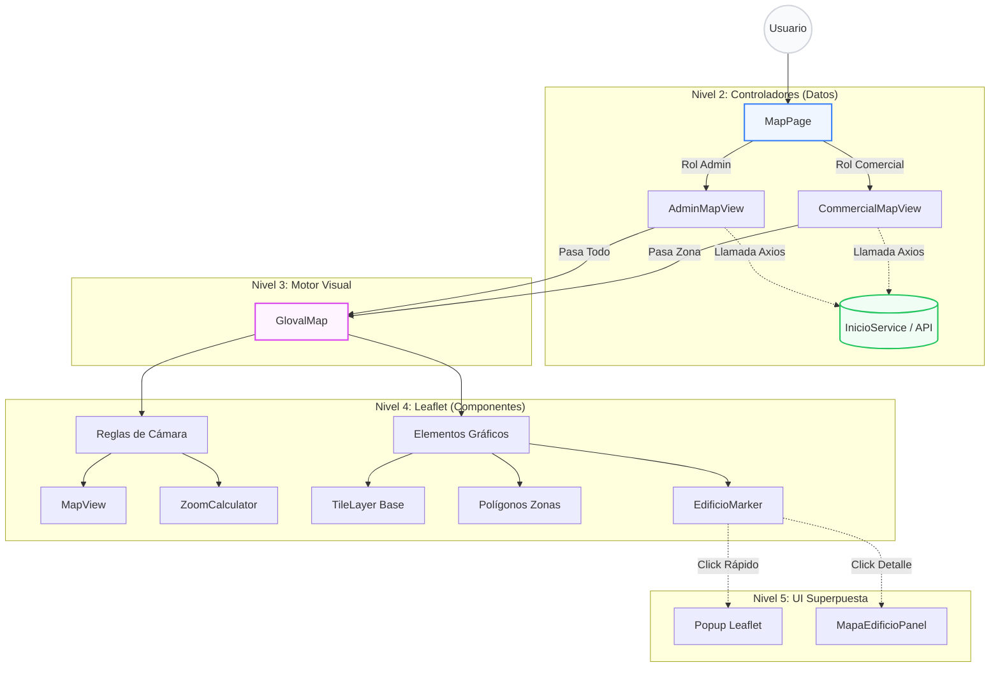

# Restricciones de Navegación de Mapa por Rol

## Descripción

Sistema profesional para controlar la visualización y navegación del mapa según el rol del usuario:

- **Admin**: Comportamiento libre, sin restricciones
- **Comercial**: Encuadre inicial con margen + restricción de movimiento

## Características

### Para Admin (sin restricciones)

- Navegación libre por todo el mapa
- Zoom ilimitado
- Sin límites de movimiento

### Para Comercial (con restricciones)

1. **Encuadre inicial con padding**:

   - Al cargar, el mapa hace zoom automático a la zona
   - Se aplica un margen de 50px alrededor de los bordes
   - Permite ver el contexto exterior holgadamente
2. **Restricción de movimiento**:

   - No puede arrastrar fuera de los límites
   - Efecto "rebote" suave si intenta salir
   - Área de navegación 20% más grande que la zona

## Uso

### Opción 1: Hook Directo (Más control)

```tsx
import { useMapBoundsRestrictions } from "../hooks/useMapBoundsRestrictions";

const MiMapa = ({ userRole, zoneArea }) => {
  useMapBoundsRestrictions({
    userRole,           // "admin" o "comercial"
    zoneArea,          // Array de GeoPoint (lat, lng)
    paddingPixels: 50, // Margen en píxeles (default: 50)
    expansionFactor: 1.2, // Expandir límites 20% (default: 1.2)
  });

  // Tu lógica del mapa...
};
```

### Opción 2: Componente MapBoundsSetup (Recomendado)

```tsx
import MapBoundsSetup from "../components/MapSetup/MapBoundsSetup";
import { MapContainer, TileLayer, Polygon } from "react-leaflet";

export const CommercialMapView = ({ userRole, zoneArea }) => {
  return (
    <MapContainer center={[37.88, -4.77]} zoom={14} style={{ height: "100%" }}>
      {/* Configurar restricciones */}
      <MapBoundsSetup
        userRole={userRole}          // "comercial"
        zoneArea={zoneArea}          // Puntos del polígono
        paddingPixels={50}           // Margen visual
        expansionFactor={1.2}        // 20% más allá del polígono
      />

      {/* Capas del mapa */}
      <TileLayer url="https://{s}.tile.openstreetmap.org/{z}/{x}/{y}.png" />

      {/* Polígono de la zona */}
      {zoneArea && (
        <Polygon
          positions={zoneArea.map((p) => [p.lat, p.lng])}
          pathOptions={{ color: "#dc2626", weight: 2 }}
        />
      )}
    </MapContainer>
  );
};
```

## Parámetros

### `userRole`

- **Tipo**: `"admin"` | `"comercial"`
- **Default**: `"admin"`
- Determina si aplica restricciones

### `zoneArea`

- **Tipo**: `GeoPoint[]`
- Array de puntos: `[{ lat: 37.88, lng: -4.77 }, ...]`
- Define el polígono de la zona

### `paddingPixels`

- **Tipo**: `number`
- **Default**: `50`
- Margen en píxeles alrededor del polígono al hacer fitBounds

### `expansionFactor`

- **Tipo**: `number`
- **Default**: `1.2`
- Factor de expansión de límites:
  - `1.0` = Sin expansión (exacto al polígono)
  - `1.2` = 20% más allá (default, recomendado)
  - `1.5` = 50% más allá (menos restrictivo)

## Ejemplo Completo: CommercialMapView

```tsx
import { useState } from "react";
import { MapContainer, TileLayer } from "react-leaflet";
import MapBoundsSetup from "../components/MapSetup/MapBoundsSetup";
import GlovalMap from "../utils/GlovalMap";

const CommercialMapView = ({ userRole, userZonaId }) => {
  const [zona, setZona] = useState(null);

  // Después de cargar datos...
  // zona = { id: 1, nombre: "Centro", area: [{lat, lng}, ...] }

  return (
    <MapContainer 
      center={[37.8847, -4.7792]} 
      zoom={14} 
      style={{ height: "100%" }}
    >
      {/* Aplicar restricciones de navegación */}
      <MapBoundsSetup
        userRole={userRole}      // "comercial"
        zoneArea={zona?.area}    // Coordenadas del polígono
        paddingPixels={50}
        expansionFactor={1.2}
      />

      <TileLayer url="https://{s}.tile.openstreetmap.org/{z}/{x}/{y}.png" />

      {/* Resto del contenido */}
    </MapContainer>
  );
};

export default CommercialMapView;
```

## Comportamiento Visual

### Admin

```
┌─────────────────────────────────────┐
│  Puede ver/navegar toda la ciudad   │
│  ┌──────────────────────────────┐   │
│  │ Zona A │ Zona B │ Centro     │   │
│  │ ┌────────────────────────┐   │   │
│  │ │ Toda la región visible │   │   │
│  │ └────────────────────────┘   │   │
│  └──────────────────────────────┘   │
└─────────────────────────────────────┘
```

### Comercial (Con restricciones)

```
┌──────────────────────────┐
│  Límite de navegación    │
│  (20% expansión)         │
│  ┌────────────────────┐  │
│  │ ZONA [POLÍGONO]    │  │
│  │ ┌──────────────┐   │  │
│  │ │ 50px padding │   │  │
│  │ └──────────────┘   │  │
│  └────────────────────┘  │
└──────────────────────────┘
↑ Si intenta salir: REBOTE (panInsideBounds)
```

## Debugging

Los logs en consola muestran:

```
✅ Restricciones de comercial aplicadas:
{
  zona: [37.8500, -4.7650] a [37.9100, -4.7450],
  padding: 50px,
  expansion: 1.2x,
  limites: "-4.765,-4.745,37.850,37.910"
}
```

## Integración con GlovalMap

Si usas GlovalMap, puedes encapsularlo:

```tsx
import GlovalMap from "../utils/GlovalMap";

// GlovalMap renderiza MapContainer internamente
// Necesitas modificar GlovalMap para aceptar:
// <GlovalMap
//   userRole="comercial"
//   zoneArea={zona.area}
//   enableMapBoundsSetup={true}
//   paddingPixels={50}
//   expansionFactor={1.2}
// />
```

## Troubleshooting

### El mapa no restringe el movimiento

- Verifica que `userRole === "comercial"`
- Verifica que `zoneArea` no está vacío
- Revisa la consola para los logs de configuración

### El padding es muy grande/pequeño

- Ajusta `paddingPixels`: 30-100px suele ser bueno

### El área de navegación es muy restrictiva

- Aumenta `expansionFactor`: 1.2 → 1.5

## Archivos Relacionados

- `src/hooks/useMapBoundsRestrictions.ts` - Hook principal
- `src/components/MapSetup/MapBoundsSetup.tsx` - Componente wrapper
- `src/components/MapViews/CommercialMapView.tsx` - Ejemplo de uso



